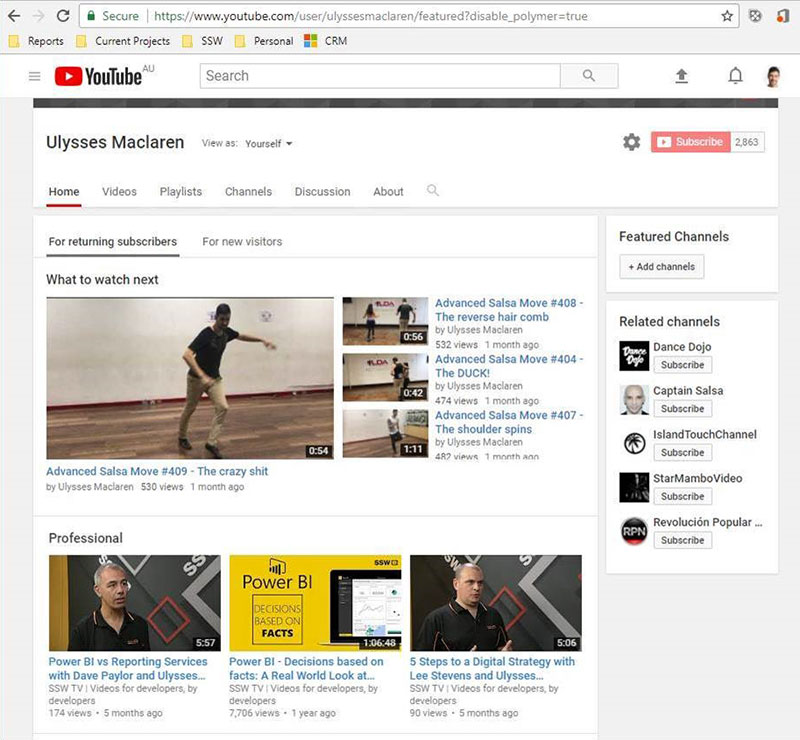

In the course of your employment, you may need or want to produce a number of videos that might be useful both for the company and for your own profile.

**For unlisted videos** (e.g. Done videos), you may [put them on **your own YouTube channel** under a playlist](https://support.google.com/youtube/answer/57792?hl=en&co=GENIE.Platform%3DDesktop) called "Professional". You can then look back to them a decade later fondly and see how much you have improved. 

<!--endintro-->

**For videos that would help your company's YouTube presence**, it's best to upload them directly onto t**he company YouTube channel**. There, you can have a playlist with your name in it, making it easier to find your videos over the years. These videos will help promote your own profile, as well as the company's.

**Note:** Those that are mostly taken in working hours, and with company equipment.

