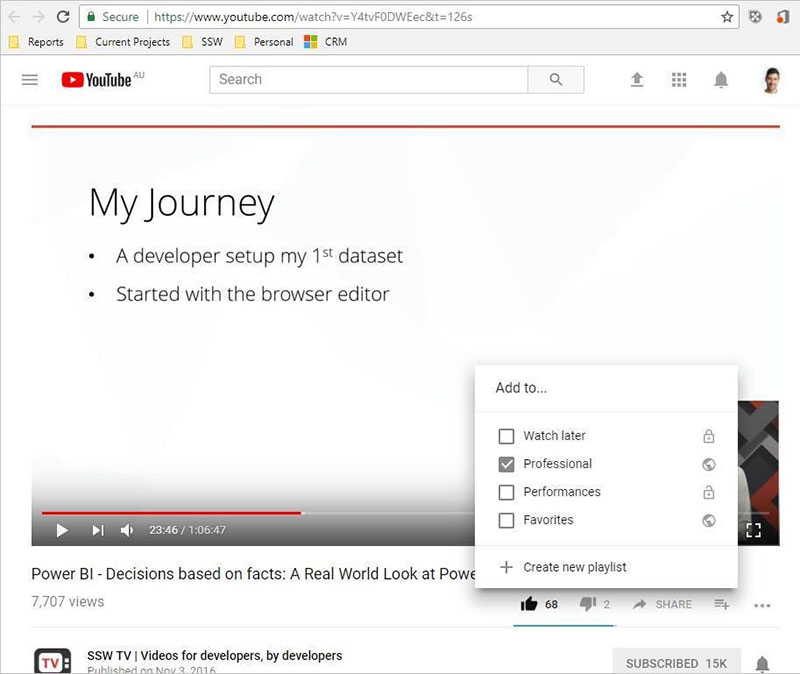

In the course of your employment, you may need or want to produce a number of videos that might be useful both for the company and for your own profile.

For unlisted videos, e.g. done videos, put them on your own YouTube channel, as you can then look back to them a decade later fondly and see how much you have improved.

<!--endintro-->

For videos taken in your own time on your own equipment, you can feel free to put that on your own channel too.

For any videos that would help your company's YouTube presence and that are taken either in company time or with company equipment, it's best to upload them directly onto the company YouTube channel, and add them to a playlist on your own channel, so they still show up there and help promote your own profile, as well as the company's.

  

