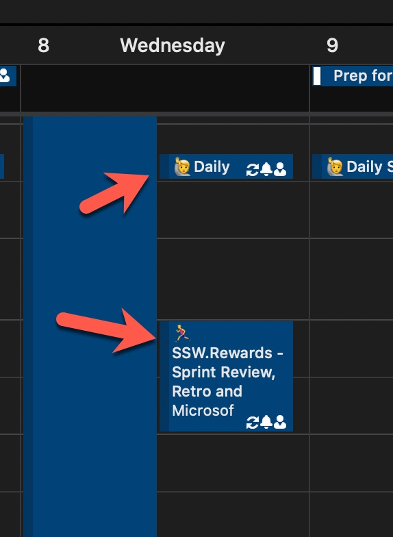

Emojis make it easier for people to quickly workout what type of content is coming up and to highlight important stuff. It works nicely for meetings, backlogs, and more. 

<!--endintro-->

An easy and fun way to have use emojis consistently in Scrum is to follow the list on [scrumoji - An emoji guide for your agile communication](https://www.scrumoji.org/).

**Tip:** Use the "Windows Key" + "." to see the emojis in your screen. 

::: bad

:::

::: good

:::
