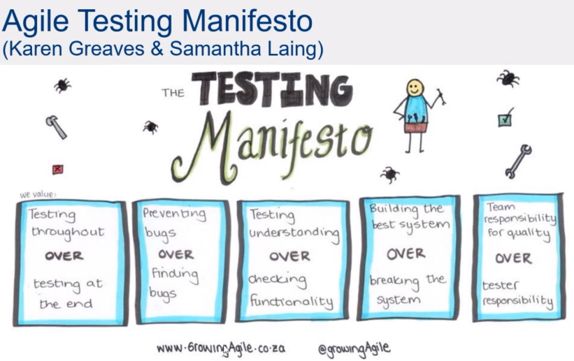

In a Scrum team, every member of the team has some responsibility for the quality of the deliverables of the team.

If you have a dedicated tester embedded in the Scrum team, they are not solely responsible for performing all of the types of testing required to help build a quality deliverable.

The idea of adopting a "whole team approach to quality" is to **build quality into** the software rather than trying to **test the problems out** of it at the end.

<!--endintro-->

## So, what is "quality"?

There are many definitions of "quality". A simple but very useful definition is:

> Quality is value to some person(s) who matter(s)\
>     - Jerry Weinberg (with changes by Michael Bolton & James Bach)

This definition highlights the fact that quality is a relationship between the user and the product - it's not the product itself, nor an element of the product. The user's perception of value is also subjective. 

Acknowledging the subjective nature of quality is important, so that we don't fall into the trap of trying to measure it. Quality is more amenable to assessment than it is to measurement.

## Testing &ne; quality

This might be hard to swallow but, just like weighing yourself doesn't cause you to lose weight: 

::: greybox
Testing does not improve quality 
:::

Testing provides valuable information about the software - and the processes involved in creating it, building it and deploying it - and it is only by acting on this information that quality may be improved.

## The whole team approach

Every member of the Scrum team has their part to play in building quality into their deliverables. There are different kinds of testing activities that rely on different skills found across the various people making up a diverse Scrum team. 

The idea is not to rely on someone with the role/title of "tester" to do *all* of the testing work!

Some examples follow of how the different roles in a Scrum team contribute to quality.

### Developer

By writing unit tests, developers enable fast feedback on code changes so that low-level problems can be identified quickly and resolved before impacting customers. 

Code reviews can help to prevent problems from even being committed to the source code repository and adhering to coding standards helps to maintain good quality at the code level.

### Scrum Master

With their key responsibility to remove blockages, the Scrum Master actively contributes to quality by ensuring that development can continue unimpeded. Any context-switching resulting from blockers increases the risk of problems being introduced. 

Keeping the Scrum board in an accurate state also assists from a quality perspective, so that the developers are working on the right things at the right time, building the highest value software for our customers.

### Product Owner

The availability of a Product Owner to provide quick and accurate feedback and answers to team members' questions is critical to building a quality product. With their focus on priorities and defining the stories to implement, the Product Owner helps to build the right thing for our customers with quality in mind.

This mission statement from Atlassian is a good expression of the aim of modern testing and quality management:

::: greybox
"We want to help ship awesome software, not just prevent poor software from being released"
*Atlassian Quality Engineering group mission (from job advertisement, April 2020)*
:::

## Tips for building quality in

### Thinking "testing", not "tester"

Testing is an activity and can potentially be performed by different members of a Scrum team, e.g. developers might write unit tests, testers might perform exploratory testing. 

By thinking in terms of the activity, "testing", rather than a person or role, "tester", it becomes more obvious that the responsibility for testing spreads across the whole Scrum team.

### Turn testing problems into problems for the whole Scrum team to address

When faced with a testing problem in the team, make it the whole team's responsibility to find solutions. Even if you have a tester embedded in the Scrum team, they might not be the best person to solve a testing problem. 

For example, suppose the software has poor testability that could be enhanced by adding hooks, APIs or logging. Assigning the work to add these testability features to a developer is probably more appropriate than giving it to the tester.

### Focus on preventing misunderstandings about feature behaviour as well as preventing defects in the code

Good practices such as code reviews and static code analysis can help to keep the codebase in a high-quality state. But having great code doesn't mean you end up with a great product! 

Focusing solely on "building it right" is only half the story, so actively take steps to ensure you're "building the right thing". Working towards a shared understanding of what it is you're building (and why) can help to prevent costly rework and dissatisfied customers.

### Use diverse perspectives from the whole team to gain a better understanding of risk

Building an understanding of the risks involved in delivering a feature is not easy, but it's made easier by utilizing diverse perspectives. 

Testers are generally skilled in risk analysis and so can be highly valuable in this process. But developers are likely to be great at thinking about technical risks and business stakeholders awesome at identifying business risks, so make use of a diverse group to more fully understand risk. 

This information is critical in formulating testing strategies to mitigate the identified risks.

### Perform diverse testing activities

Examples:

* Having conversations to build shared understanding
* Asking questions to test ideas and assumptions
* Automating tests
* Performing exploratory testing
* Testing for quality attributes such as performance, reliability and security
* Learning from production usage

Use whole team retros and small experiments to continually improve testing and quality and find out what works in your context. 

Deliberately adding an item for testing and quality onto your Sprint Retro agenda can be helpful as a reminder.

## The Agile Testing Manifesto

Many of the mindset shifts required to think in terms of a whole team approach to quality are nicely encapsulated in the Agile Testing Manifesto (which is deliberately phrased in a similar way to the [Agile Manifesto](https://agilemanifesto.org/)).

## Some anti-patterns

There are some common anti-patterns that indicate a Scrum team is not taking a whole team approach to quality.

### The "testing phase"

If you still refer to a "testing phase", it's likely that testing is not seen as an activity but rather a stage or phase. 

Testing should be a continuous process, working alongside development to perform appropriate types of testing at the right time throughout story development.

## Asking "how did QA miss this bug?"
we should aim to prevent bugs rather than focusing on finding them
aim to help build the best system possible instead of trying to break it
emphasizes the whole team responsibility for quality.

### Testing a sprint behind development

### Focus on meeting the sprint commitment over meeting the DoD

cheating - and cheats always get found out!

**Add your rule to categories: Rules to Better Testing and Rules to Better Scrum**
 **Think about related rules**