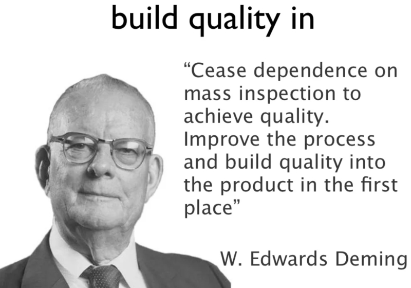

In a Scrum team, every member of the team has some responsibility for the quality of the deliverables of the team.

If you have a dedicated tester embedded in the Scrum team, they are not solely responsible for performing all of the types of testing required to build a quality deliverable.

The idea of adopting a "whole team approach to quality" is to **build quality in** the software rather than trying to **test the problems out** of it at the end.

<!--endintro-->

testing manifesto ideas?

Might need some other content to differentiate between quality and testing before this makes sense (e.g. testing doesn’t improve quality). 

Idea is whole team approach stuff, not relying on someone with the role/title of “tester” to do the testing work

trawl my previous presos on this topic for ideas

approach is to "build quality in" vs "test bugs out"

testing is an activity rather than a phase, we should aim to prevent bugs rather than focusing on finding them, look at testing over checking, aim to help build the best system possible instead of trying to break it, and emphasizes the whole team responsibility for quality.

**Add your rule to categories: Rules to Better Testing and Rules to Better Scrum**