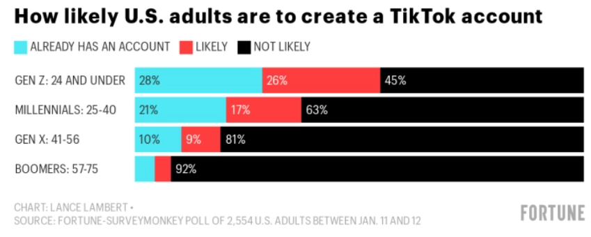

TikTok has rapidly become one of the most popular social media platforms worldwide since it was launched in 2016, but do you really need it? 

It is important to know your business ‘why’ and the main purpose of being on a platform such as TikTok.

For example, the main purpose of [SSW's TikTok](https://www.tiktok.com/@ssw_tv) is to attract awesome engineers from all walks of life, showcase our offices, the cool software and tech we work on, and deliver hot tips on our tech stack.

<!--endintro-->

Let's learn a few reasons why a business should be on TikTok:

1. Exposure – Over [a billion active users per month](https://www.businessofapps.com/data/tik-tok-statistics/).\
   TikTok has users in over 150 countries. For example:

   1. 100M+ United States
   2. 80M+ Indonesia
   3. 70M+ Brazil
   4. 50M+ Russia
   5. 50M+ Mexico
2. New Audience base – Get access to the under 25s, as well as a large female audience.

   1. Large percentage of users under 18 and between 19-29 [(over half under 30 years old)](https://www.businessofapps.com/data/tik-tok-statistics/)
   2. Over half of users are female
3. Maximize Creativity – Explore a different side of your business, like what makes you fun and interesting. The people and culture at your company are important, and putting a fun video of your employees on TikTok is more appropriate than say LinkedIn, where the same video would be potentially received poorly as it is not "business" enough.
4. Unique Algorithm – TikTok will recommend videos that match your interests. It uses data like your location, hashtags you follow or use, and of course videos you like. TikTok gives you a personalized feed ‘For You’, which is similar to your Instagram’s ‘Explore’ page.\
   As [TikTok explains](https://newsroom.tiktok.com/en-us/how-tiktok-recommends-videos-for-you):

   > "When you open TikTok and land in your 'For You' feed, you're presented with a stream of videos curated to your interests, making it easy to find content and creators you love. This feed is powered by a recommendation system that delivers content to each user that is likely to be of interest to that particular user."
5. Paid Ads – There are a few different types of ads that you can launch on TikTok, depending on your goals and audience. You can view a [guide to paid TikTok advertizing](https://viscapmedia.com/articles/guide-to-paid-tiktok-advertising/).
6. Real-time analytics – Track your profile’s performance, understand your audience demographic, and measure your success.

  

   **Source:** [TikTok to the moon? The app is outgrowing its Gen Z stereotype](https://fortune.com/2021/02/15/tiktok-gen-z-users-age-groups-survey/)

Know more on [Adam Cogan Blog: Tech World on TikTok - Is it for you?](https://adamcogan.com/2022/05/10/tech-world-on-tiktok-is-it-for-you/)
