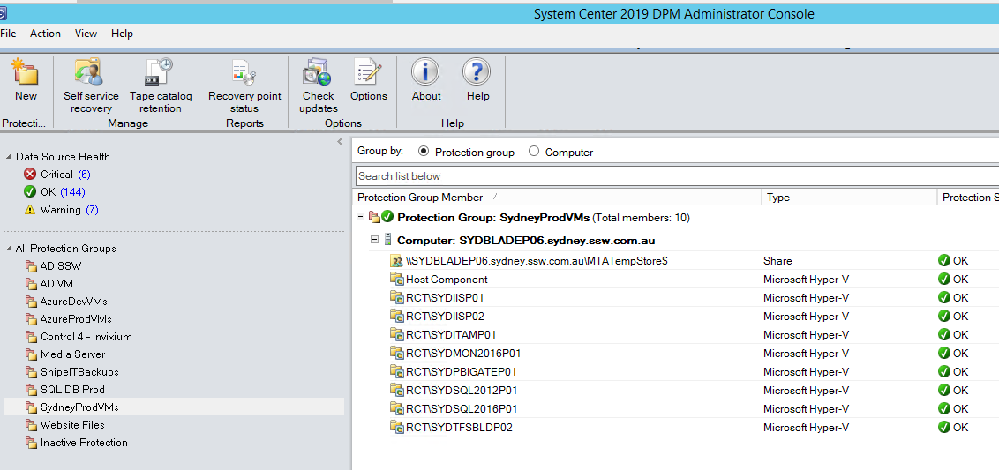
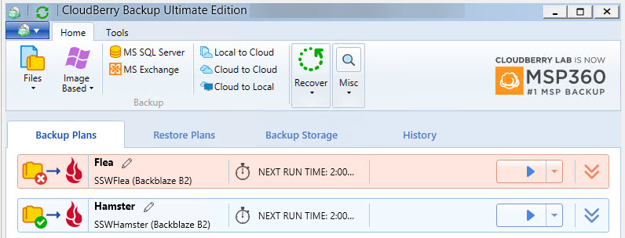

Every company needs a business continuity and disaster recovery plan. DPM is a robust backup solution for on-premises backups. It can give you peace of mind knowing that your data is backed up, safe and easily restorable. It allows for backing up of:

<!--endintro-->

* Virtual Machines (Hyper-V and VMware)
* Physical Machines
* Application Aware Backups

  * Exchange
  * SQL
  * SharePoint

It also allows for storage over many platforms:

* Disk
* Tape
* Cloud (Uses Azure Site Recovery and Backup)

It is fast and easy to recover VMs and files from DPM, making this the best tool to have your local backups on. 

It is also important to keep DPM backups healthy by monitoring their status frequently.

### How do you get your on-premises backups off-site?

DPM is great for the above tasks, but for off-site backups or cloud backups, other tools are best. You generally need to set up a physical machine with enough storage for DPM, so you have some options depending on your services:

* Off-site - Your on-premises DPM backup should always have a secondary location:
    * Another office, with another DPM server
    * The cloud, with Azure Site Recovery

* Virtual Machines - VMs generally need quick recovery and backup. The best (but more expensive) option is Azure Site Recovery. You can read more about that at www.ssw.com.au/rules/azure-site-recovery

* File Servers - Generally, file servers need an auto-expanding, cheaper and simpler cloud backup. The best tool is MSP360 (was CloudBerry) which backs up to Backblaze (cloud storage).

