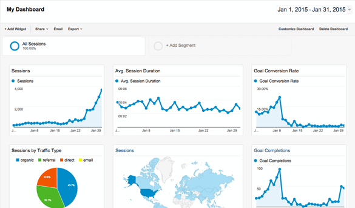
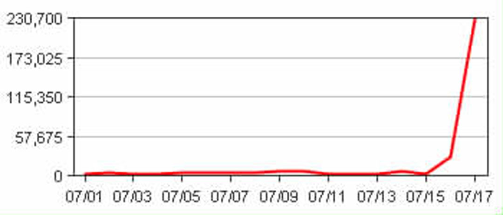

Knowing the holistic health of your application is important once it has been deployed into production. Getting feedback on your Availability, errors, performance, and usage is an important part of DevOps.
We recommend using Application Insights, as getting it set up and running is quick, simple and relatively painless.

Application Insights will tell you if your application goes down or runs slowly under load. If there are any uncaught exceptions, you'll be able to drill into the code to pinpoint the problem. You can also find out what your users are doing with the application so that you can tune it to their needs in each development cycle.

<!--endintro-->

  

  

1. You need a portal for your app
2. You need to know spikes are dangerous
3. You need to monitor:
    1. Errors
    2. Performance
    3. Usage

  

  

To add Application Insights to your application, make sure you follow the rule [Do you know how to set up Application Insights?](/how-to-set-up-application-insights)

Can't use Application Insights? Check out the following rule [Do you use the best exception handling library](/do-you-use-the-best-exception-handling-library) ?
