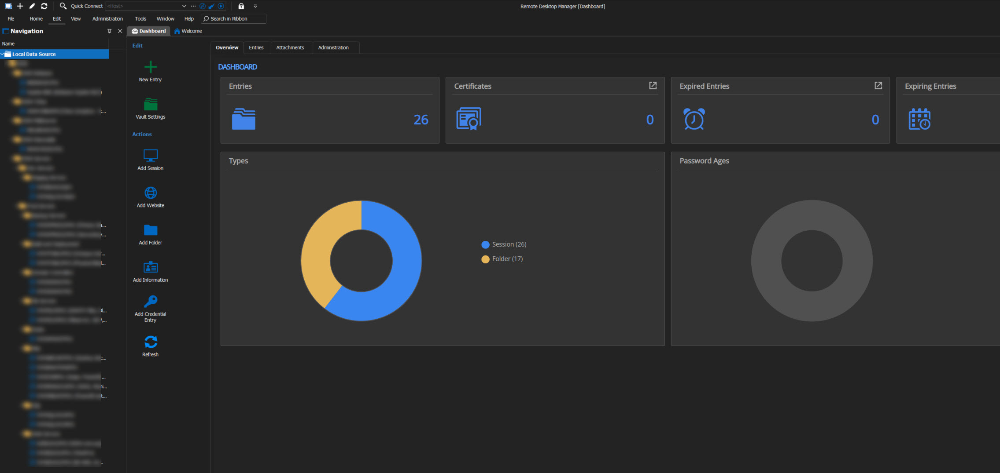

Managing multiple servers and computers located at different locations can be challenging, which is why remote access is often used as a solution. Remote access allows you to remotely log in to a system, making it easier to manage server maintenance. 

Windows provides an inbuilt remote desktop connection that enables remote access to any computer or server within the network. In addition, there are third-party applications like [Remote Desktop Manager](https://www.ssw.com.au/rules/remote-desktop-manager/), which can be useful for managing remote connections. 

An alternative to RDM is Windows Admin Center (WAC), a web-based management tool designed to provide a centralized management console for multiple Windows Servers. WAC offers a more comprehensive set of management features than RDM, including performance monitoring, event log viewing, storage management, and PowerShell scripting.

Unlike RDM, WAC can be installed on a server or client system and accessed remotely through a browser, providing a more user-friendly and comprehensive solution for managing Windows systems. This makes WAC the better choice for organizations looking to simplify their management workflows and improve security.
:::good

:::
:::bad

:::
Some of the key features of Windows Admin Center include:

1.	Server management: Windows Admin Center provides a unified dashboard for managing servers running Windows Server 2012 and later versions. Administrators can use Windows Admin Center to manage server roles and features, such as Active Directory, DNS, DHCP, and Hyper-V.
2.	Remote management: Windows Admin Center allows administrators to remotely manage servers, clusters, and HCI environments using a web browser. It provides a secure and scalable solution for managing servers from any location.
3.	Hyper-converged infrastructure management: Windows Admin Center provides a simplified interface for managing hyper-converged infrastructure environments, including Storage Spaces Direct (S2D), Hyper-V, and software-defined networking (SDN).
4.	Performance monitoring: Windows Admin Center includes built-in performance monitoring tools for monitoring system resources, such as CPU, memory, and disk usage. Administrators can also configure alerts to notify them of critical events or system thresholds.
5.	Backup and disaster recovery: Windows Admin Center integrates with Windows Server Backup and Microsoft Azure Backup to provide a centralized backup and disaster recovery solution for Windows servers and clusters.
6.	Security: Windows Admin Center supports role-based access control (RBAC) and multi-factor authentication (MFA) to secure access to servers and clusters. It also provides built-in security features, such as security baselines and security alerts.

Overall, Windows Admin Center provides a powerful and flexible management tool for Windows servers and clusters that simplifies administration, improves security, and enhances performance monitoring and management.