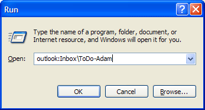

Aside from ease of installation, what is the one thing a web browsers has over a Windows Forms application? - a URL!  

With a Windows Forms application, you typically have to wade through layers of menus and options to find a particular record or "page". However, Outlook has a unique feature which allows you to jump to a folder or item directly from the command line.

<!--endintro--> 




We believe that all applications should have this capability. You can add it to a Windows Application using the following procedure:

1. Add the necessary registry keys for the application  

* HKEY_CLASSES_ROOT\\**AppName**\URL Protocol = ""
* HKEY_CLASSES_ROOT\\**AppName**\Default Value = "URL:Outlook Folders"
* HKEY_CLASSES_ROOT\\**AppName**\shell\Default Value = "open"
* HKEY_CLASSES_ROOT\\**AppName**\shell\open\command\Default Value = "**Path\AssemblyName.exe** /select %1"

2. Add code into your main method to handle the extra parameters

**C#:** 

```cs
public static void Main(string[] args)
{
   ...

   if(args.Length > 0)
   {
      string commandData = args[1].Substring(args[1].IndexOf(":") +
        1).Replace("\"", String.Empty);

      Form requestedForm = null;

      switch(commandData)
      {
         case "Client":
         {
            requestedForm = new ClientForm();
            break;
         }
         // Handle other values
         default: // Command line parameter is invalid
         {
            MessageBox.Show("The command line parameter specified" +
               " was invalid.", "SSW Demo App",
                  MessageBoxButtons.OK, MessageBoxIcon.Error);

            // Exit the application
            return;
         }
      }

      requestedForm.Show();

      // Show the main form as well
      MainForm mainForm = new MainForm();
      mainForm.Show();

      // Give the requested form focus
      requestedForm.Focus();

      Application.Run(mainForm);
   }
   else // No command line parameters
   {
      // Just show the main form
      Application.Run(new MainForm());
   }
}
```

**VB.NET:**

```vb
Public Shared Sub Main()
   ...
```

```vb
Dim args As String = Microsoft.VisualBasic.Command()

   If args.Length > 0
      Dim commandData As String = _
         args.Substring(args.IndexOf(":") + 1).Replace("""", "")
      Dim requestedForm As Form = Nothing

      Select Case commandData
         Case "Client"
            requestedForm = New ClientForm()

         ' Handle other values

         Case Else ' Command line parameter is invalid
	 MessageBox.Show("The command line parameter specified " &_
            "was invalid.", "SSW Demo App", MessageBoxButtons.OK, &_
            MessageBoxIcon.Error);

         ' Exit the application
         Exit Sub
      End Select

      requestedForm.Show()

      ' Show the main form as well
      Dim mainForm As MainForm = New MainForm()
      mainForm.Show()

      ' Give the requested form focus
      requestedForm.Focus()

      Application.Run(mainForm);

      Else ' No command line parameters, just show the main form
      Application.Run(new MainForm())
   End If
End Sub
```

**Sample code implementation in the [SSW .NET Toolkit](https://ssw.com.au/ssw/NETToolkit)**
