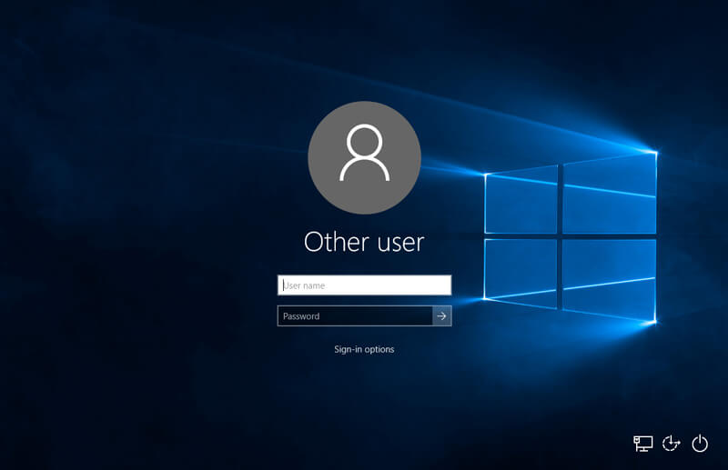
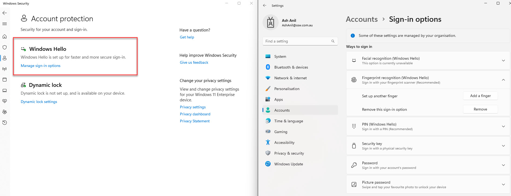

Windows Hello allows users to sign into their devices, apps, and online services using their face, fingerprint, or iris recognition, instead of traditional passwords to authenticate users' identities quickly, accurately, and securely.

<!--endintro-->

## Windows Hello for Secure Authentication

Users have the option to set up a personal PIN or biometric gesture for easy sign-in on their devices. This feature, known as Windows Hello convenience PIN, is specific to the device on which it is configured and may use a password hash based on the user's account type.

Windows Hello offers several advantages for users who want a secure and convenient way to authenticate to their devices and accounts. Here are some of the benefits of using Windows Hello:

* **Stronger Security:** Windows Hello provides strong biometric authentication that is difficult to fake or duplicate, making it more secure than traditional password-based authentication.
* **Convenient Sign-in:** With Windows Hello, users can sign in to their devices and accounts with a simple biometric gesture, such as a fingerprint or facial recognition, eliminating the need to remember complex passwords.
* **Faster Access:** Using Windows Hello for authentication is faster than typing in a password, enabling users to access their devices and accounts quickly and easily.
* **Wide Compatibility:** Windows Hello is compatible with a wide range of devices, including laptops, tablets, and smartphones.
* **Local Storage:** Windows Hello stores biometric data securely on the local device, so users can rest assured that their data is safe and not being sent to external devices or servers.

## Windows Hello for Business

Windows Hello for Business is a passwordless authentication method that allows users to sign in to their devices using biometric authentication, such as facial recognition or fingerprint scanning. This is configured by group policy or mobile device management (MDM) policy, which always uses key-based or certificate-based authentication.

Before using Windows Hello for Business, you must ensure that the following requirements are met:

* The device must be running Windows 10 version 1607 or later.
* The device must have a compatible camera or fingerprint reader.
* The device must support the Windows Hello for Business feature.
* The user must have an Azure AD account and be registered for Windows Hello for Business.

:::bad

:::

:::good

:::
