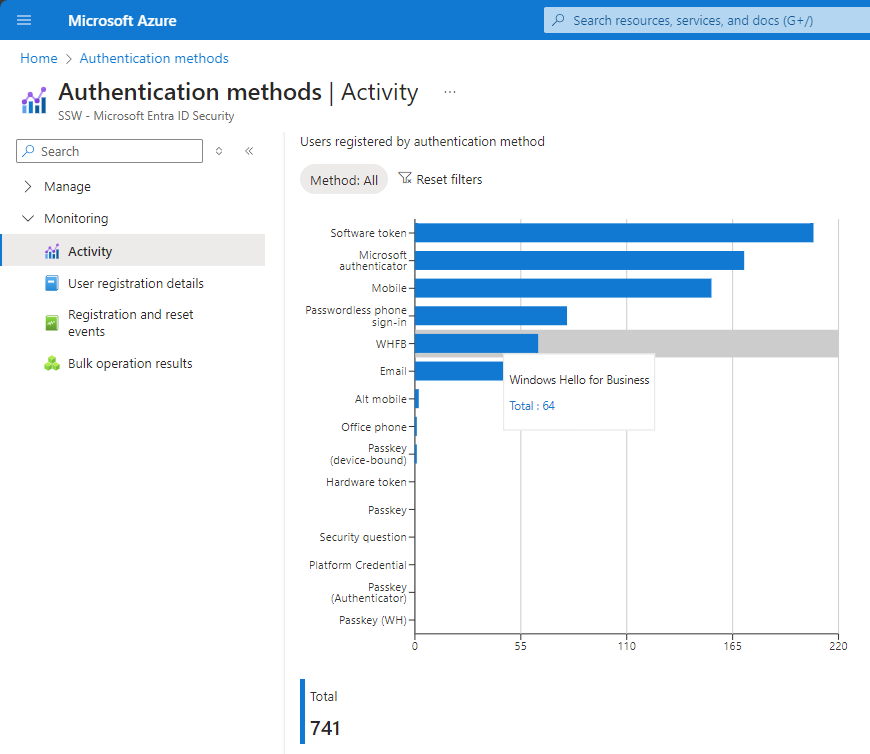

Windows Hello allows users to sign into their devices using facial recognition, fingerprint, or a PIN, instead of traditional passwords to authenticate quickly, accurately, and securely.

<!--endintro-->

## Windows Hello for Secure Authentication

Users have the option to set up a PIN, facial recognition, or a fingerprint for easy sign-in on their devices. This is specific to the device on which it is configured and may use a password hash based on the user's account type.

Here are some of the benefits of using Windows Hello:

* **Stronger Security:** Strong biometric authentication that is difficult to fake or duplicate, making it more secure than traditional password-based authentication.
* **Convenient Sign-in:** Users can sign in to their devices and accounts with a simple biometric gesture, such as a fingerprint or facial recognition, eliminating the need to remember complex passwords.
* **Faster Access:** Authentication is faster than typing in a password, enabling users to access their devices and accounts quickly and easily.
* **Wide Compatibility:** Works with a wide range of devices, including laptops, tablets, and smartphones.
* **Local Storage:** Biometric data is stored securely on the local device, so users can rest assured that their data is safe and not being sent to external devices or servers.

## Windows Hello for Business

Windows Hello for Business is a Passwordless authentication method that allows users to sign in to their enterprise devices using biometric authentication, such as facial recognition or fingerprint scanning. It is configured by group policy or Intune, and always uses key-based or certificate-based authentication.

Before using Windows Hello for Business, you must ensure that the following requirements are met:

* The device must be running Windows 10 version 1607 or later.
* The device must have a compatible camera or fingerprint reader.
* The device must support the Windows Hello for Business feature.
* The user must have an Azure AD account and be registered for Windows Hello for Business.

:::bad

:::

:::good

:::

You can check Windows Hello for Business usage in the Azure portal - go to **Microsoft Entra authentication methods | Monitoring | [Activity](https://portal.azure.com/#view/Microsoft_AAD_IAM/AuthenticationMethodsMenuBlade/~/AuthMethodsActivity)**. From there, you can see registrations and usage stats for Windows Hello for Business and other methods.

