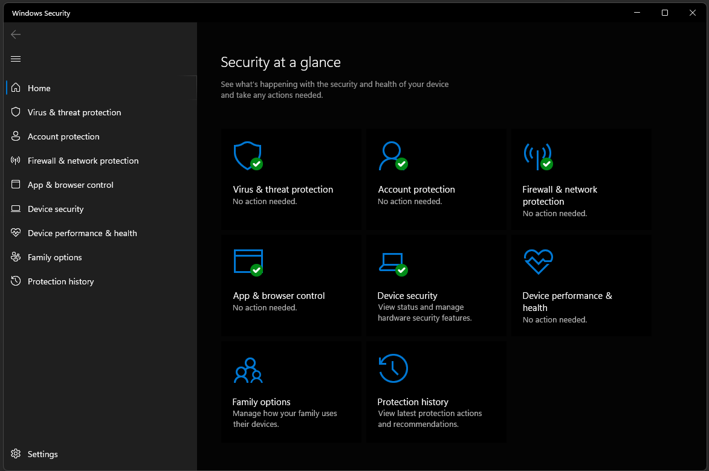

Often users don't know how to properly secure their computer and open themselves to vulnerabilities. Windows Security solves this by ensuring that a PC is running all the best practices to keep it safe from harm.

<!--endintro-->

The most important aspect of Windows Security is to check that you have the 5 green ticks. These ticks mean your computer is following the best practices for security.

