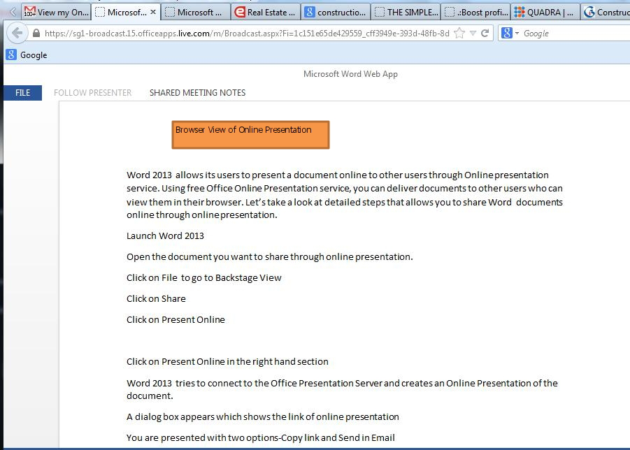
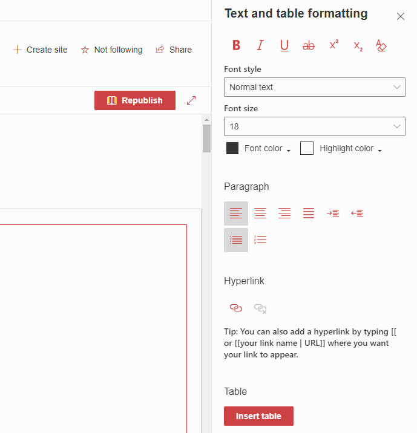
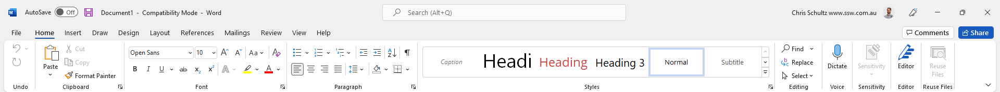

In the past, wiki pages were a great way to store content in SharePoint. These days, with advancements in browser and smartphone capabilities, Word Documents are a better place to store content. 

<!--endintro-->

Many articles, like [this one from 2017](https://www.sharepointagency.co.nz/consulting/item/348-wiki-pages-are-better-than-word-documents-for-your-intranet.html), talk about the benefits of using Wiki pages over Word Documents - however, these benefits are no longer relevant. 

Let's have a quick look at some of the points that the article above used:

**Accuracy** - It's easy to see the Modified date of documents in SharePoint, and versioning should be used to show that the document is the most current one (of course, it should be the only one).

**Load Time** - In the past, this was an issue. These days, browsers have no problem loading Word Documents.

**Mobile** - Mobile browsers also do a pretty good job of opening Word Documents, and there are the Office and OneDrive apps to make it even easier.

The main advantage of Word Documents is the editing capabilities – most people are familiar with the rich document editing features of Word. The SharePoint wiki page editor has fewer features, and can be harder to use.

::: bad

:::

::: good

:::