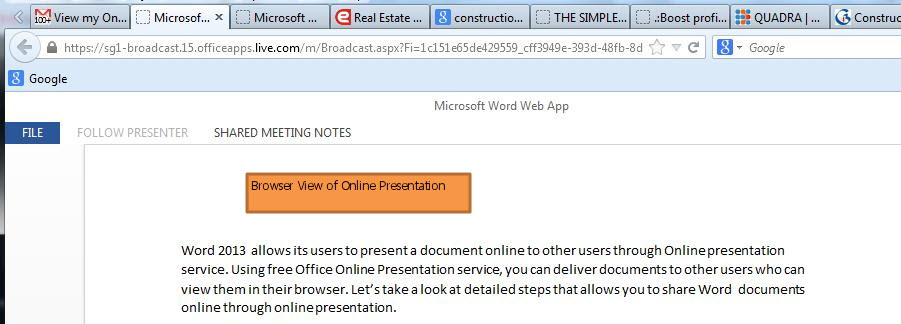
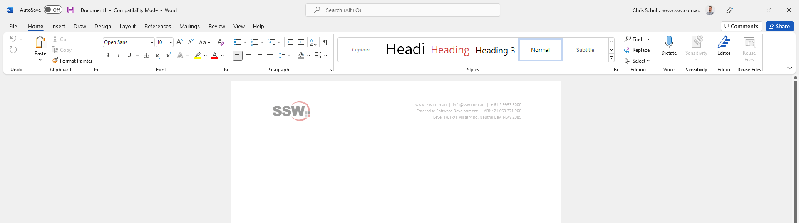

In the past, Wiki pages were a great way to store content in SharePoint. These days, with advancements in browser and smartphone capabilities, Word Documents are a better place to store content. 

<!--endintro-->

Many articles, like [this one from 2017](https://www.sharepointagency.co.nz/consulting/item/348-wiki-pages-are-better-than-word-documents-for-your-intranet.html), talk about the benefits of using Wiki Pages over Word Documents - however, these benefits are no longer relevant. 

Let's have a quick look at some of the points that the article above used:

**Accuracy** - It's easy to see the Modified date of documents in SharePoint, so you can tell if the Document is the most current one (of course, it should be the only one).

**Load Time** - In the past, this was an issue. These days, browsers have no problem loading Word Documents.

**Mobile** - Mobile browsers also do a pretty good job of opening Word Documents, and there are the Office and OneDrive apps to make it even easier.

::: greybox

Note: If you want to create an actual Wiki within SharePoint, Modern Pages may be the way to go - but for general content, Word Documents are best.

:::

### Advantages of Word Documents

1. One main advantage of Word Documents is the editing capabilities – most people are familiar with the rich document editing features of Word. Documents can be created in the desktop app as it has the most editing capabilities, and can be easily edited in the web version - which is still very good! The SharePoint wiki page editor has fewer features, and can be harder to use.

::: bad

:::

::: good

:::

2. Versioning is one of SharePoint's strongest features - and it works really well with Word Documents. 
3. Many people are using Microsoft Teams, and storing files in there - sometimes not using SharePoint at all. While Teams still uses SharePoint in the backend, it is much easier to browse through Documents than link and view Wiki Pages.

4. OneDrive allows you to sync files from SharePoint libraries to your computer. This is very useful if you need offline access, or if users prefer to work from files within File Explorer in Windows, or Finder on macOS. This works really well with Word Documents, but is not possible with wiki pages.