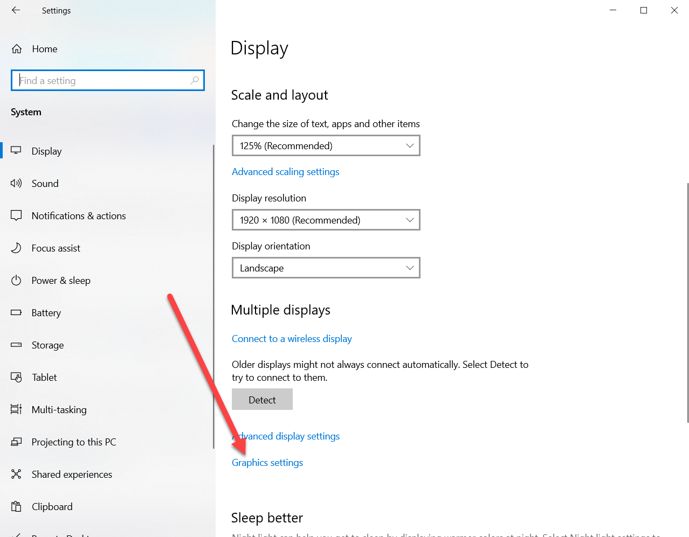
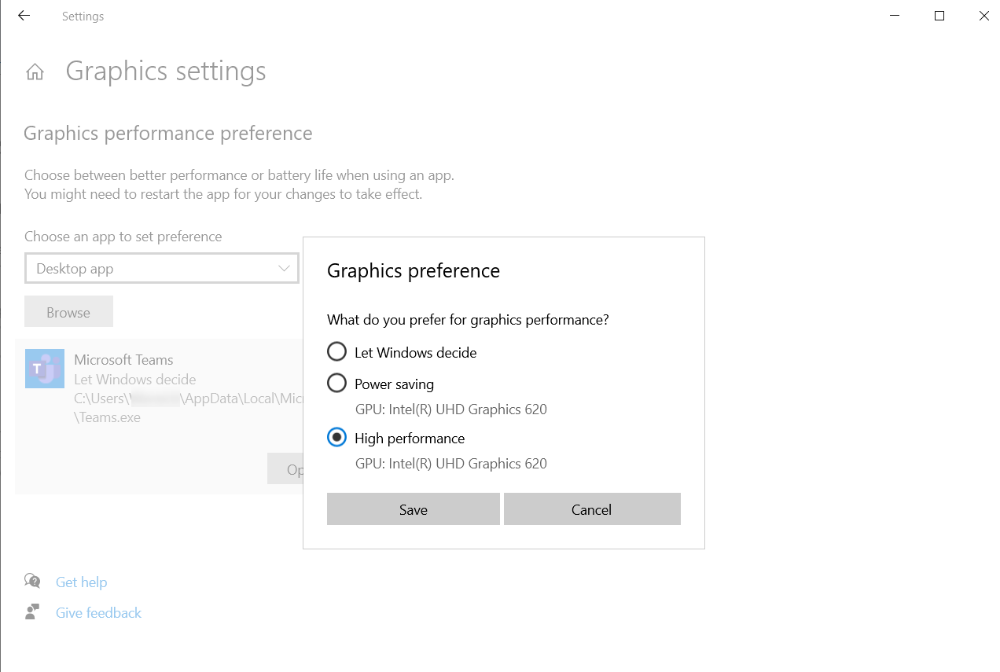

Having poor performance on video chat?

In Windows 10/11 you need to set your video chat app (i.e. Teams) to use the GPU.

<!--endintro-->

1. Open Settings | System | Display
2. Scroll down a bit and click Graphics settings
   
3. Either choose Microsoft Store apps and choose the relevant app or choose Desktop apps and browse for the executable
    ::::greybox
   **Note:** Microsoft Teams is a desktop app under your local user profile i.e. C:\Users%username%\AppData\Local\Microsoft\Teams\current\teams.exe
    ::::
4. Select options and choose High Performance GPU

   
