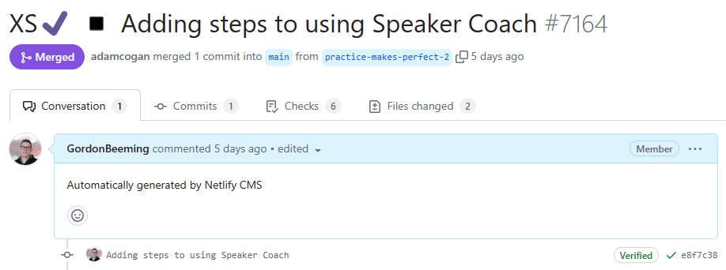
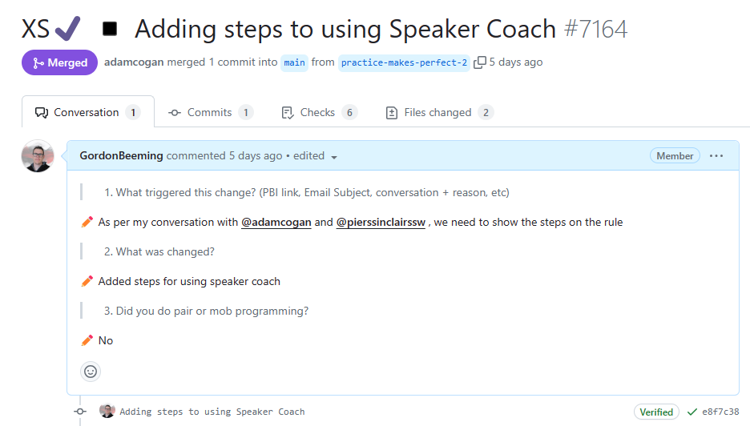

As a software developer, you are going to create Pull Requests (PRs) that you want to be easy for others to review and approve. The quality of a Pull Request can vary - from cryptic to well-written.

Including a little bit of context helps your reviewer understand changes quickly so they can review your PR faster and give better suggestions.

There are 2 easy things you can do to improve your Pull Request:

<!--endintro-->

### 1. Write a concise and self-explanatory title

The key to writing a concise Pull Request is to base the PR itself on a PBI / issue.

Good **titles** cover:

* What the Pull Request will do
* How the Pull Request achieved it
* Emojis! Follow the [GitMoji.dev](https://gitmoji.dev) standard

Examples:

**PBI title:** Product Backlog Item 100359: "Desktop App | Exporting occasionally failed"

::: greybox
**Pull Request title:** Fix exporting
:::
::: bad
Bad example - Pull Request title does not tell what issues have been fixed and how
:::

::: greybox
**Pull Request title:** 🐛 BUG - Fix desktop app exporting - prevent database concurrent access while exporting
:::
::: good
Good example - Pull Request title briefly describes the fix that it has
:::

Having the **"What"** information allows the reviewers to quickly understand what this is about while having the "How" can help the reviewer to quickly understand how your PR solved the problem. Sometimes we might want to put the **"How"** in the PR body if it is too long or hard to explain in one sentence.

### 2. Write a clear and concise description

The Pull Request description is a medium for the developer to tell the reviewers what the changes are about.

::: info
**Tip:** For straight-forward changes the self-explanatory title might be enough. You should still include context so the reviewer knows what initiated the changes (examples below)
:::

Good **descriptions** cover:

* Context:

  * Relates to #{{ ISSUE NUMBER or URL}} (⚠️ see [avoid linking any Issues that you do not want to close](/avoid-auto-closing-issues/))
  * From email: {{ SUBJECT }} (like the rule [Warn then call](/warn-then-call))
  * As per my conversation with {{ NAME }} (like the rule [Do you send as per our conversation emails](/as-per-our-conversation-emails))
  * I noticed a problem: {{ DESCRIBE }}

::: info
Linking the source to a PR serves as documentation on which development work that was done. It helps in the future to debug when and which changes were introduced and the original specification of that piece of work.
:::

::: info
**Tip:** If you noticed that a change needed to be made and had no specific task/issue, use 'I noticed...' from above.
:::

* Pair or mob programming?

As per [Do you use Co-Creation Patterns?](/do-you-use-co-creation-patterns). E.g. "Worked with @bob, @mary and @jane"

* What the PR is about and why you raised it

* How the PR will achieve the feature / fix the bug / other goals

* Screenshots / Done Videos to help the reviewer to understand the changes. E.g. Styling changes

* Tell reviewers if there is an area you are uncertain about. E.g. "I'm looking for feedback on this code"

::: greybox
**PR title:** Update Rule “meaningful-pbi-titles/rule”

**PR description:**
:::
::: bad
Figure: Bad example - Cannot tell what was done here
:::

::: greybox
**PR title:** Update Rule “meaningful-pbi-titles/rule”

**PR description:** Changes made:

1. Added missing video figure to embedded YouTube video
2. Fixed typo:\
   From:\
   Use emojis. See our rule on emojis in Scrum).\
   To:\
   Use emojis. See our rule on emojis in Scrum

:::
::: ok
Figure: OK example - What was done is clear, but both editor and reviewer may spend too much time on the description of such simple changes
:::

Try to make generic comments that objectively summarize your changes. This way the reviewer will know what to expect and confirm the changes by looking at the file diffs.

::: greybox
**PR title:** Update Rule “meaningful-pbi-titles/rule”

**PR description:** Added missing video caption + removed unnecessary brackets
:::
::: ok
Figure: OK example - Clear and concise description, however it's not clear what task triggered the change
:::

::: greybox
**PR title:** Update Rule “meaningful-pbi-titles/rule”

**PR description:**
From email, subject: SSW.Rules - Video caption missing
Added missing video caption + removed unnecessary brackets
:::
::: good
Figure: Good example - It's clear what changes are being made and where the task came from
:::

::: info
There is also well-known Pull Request semantics like [Conventional Commits](https://www.conventionalcommits.org/en/v1.0.0/) on how to write a PR body, but we can still have a great PR without using such preciseness.
:::

#### FAQs

**Q: Are you making many small changes?**

A: You should summarize by saying: *“Improved readability”* OR *“Fixed typos and grammar”*.

**Q: Are the changes big and complex?**

A: You should include a demonstration of the change.  
E.g. A [screenshot](/screenshots-avoid-walls-of-text) to show text/UI changes, or a [Done video](/record-a-quick-and-dirty-done-video) to demo functionality changes.

**Q: Are you using a GUI editor (like Netlify or Tina)**

A: If you're using a GUI editor for your PRs, you may need to go to the PR afterward and update the description to include the context

::: bad

:::

::: good

:::
