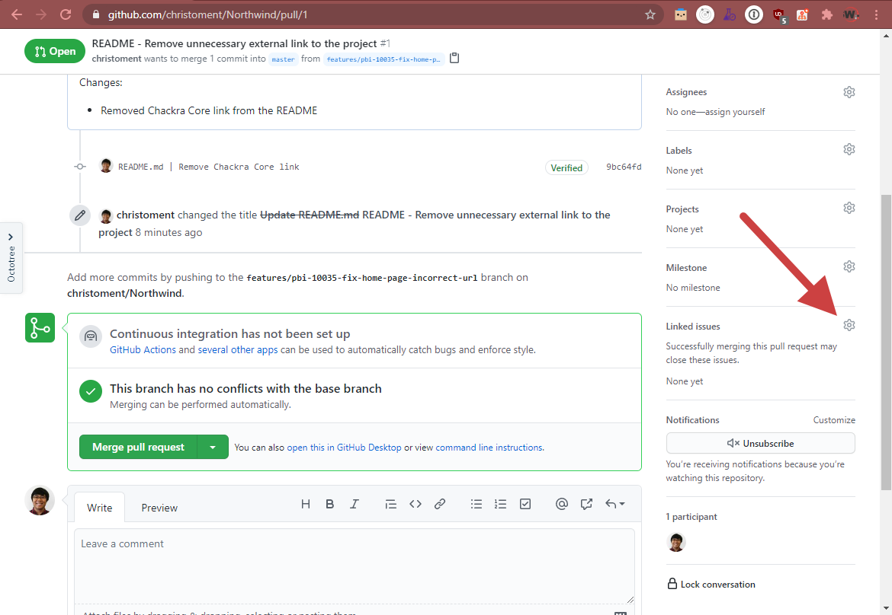
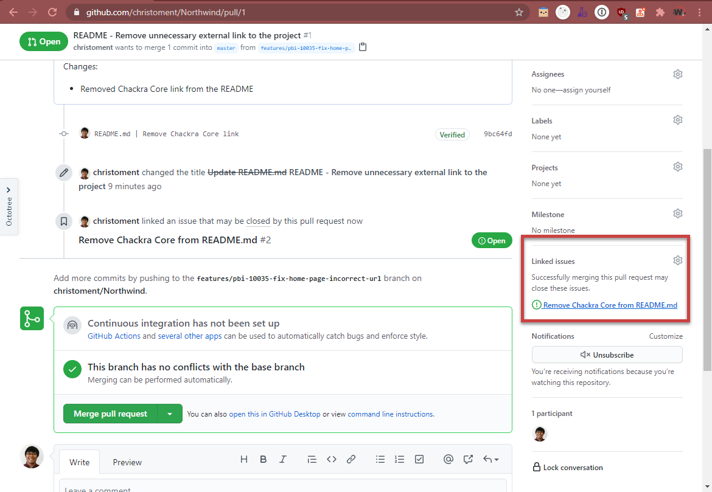

As a software developer, it is very common to work with Pull Requests. The quality of a Pull Request (PR) can vary - sometimes we have to deal with a cryptic PR and sometimes we find a very well written one.

Having detailed information can help your peers to understand changes quickly so they can review your PR faster, and also give better suggestions.

<!--endintro-->

While any Pull Request itself is valid and may offer a high value, the reviewer need to spend a bit of time to understand what is the context and [what does it change](/useful-information-on-changes). This step can take from 1 minute (if reviewer just recently touched the code) to 10+ minutes (if it has been a long time since the reviewer worked on it, or have never even touched the code).

Writing a great PR can help your peers to understand your code better and therefore, they can give you better insights and faster review turnaround time. That's great!

Things you can do to improve your Pull Request:

1. Write a concise and self-explanatory title
2. Write a concise and descriptive body
3. Link the pull request to the associated issues / PBIs

### 1. Write a concise and self-explanatory title

The key to writing a concise pull request is to base the PR itself on a PBI / issue.

Examples:

::: greybox
**PBI title:**  Product Backlog Item 100359: "Desktop App | Exporting occasionally failed"
:::

::: greybox
**Pull Request title:** Fix exporting
:::
::: bad
Bad example - Pull request title does not tell what issues have been fixed and how
:::

::: greybox
**Pull Request title:** 🐛 Fix desktop app exporting - prevent database concurrent access while exporting
:::
::: good
Good example - Pull request title briefly describe the fix that it has
:::

The important information in the title are:

* What the pull request will do
* How the pull request achieved it

Having the **"What"** information allows the reviewers to quickly understand what this is about while having the "How" can help the reviewer to quickly understand how your PR solved the problem. Sometimes we might want to put the **"How"** in the PR body if it is too long or hard to explain in one sentence.

::: info
**Tip:** Use emojis! - follow the [GitMoji.dev](https://gitmoji.dev) standard
:::

### 2. Write a concise and descriptive body

The PR body is a medium for the developer to tell the reviewers what the changes are about. 

::: info
**Tip:** For straight-forward changes the self-explanatory title might be enough to describe the changes, although it is still important to clarify what initiated the changes, e.g.: an issue, email, or conversation.
:::

Things that need to be kept in mind before writing a Pull Request body:

* What the PR is about and why did you raise it
* What triggered the PR (e.g. an issue, email, or conversation)
* How the PR will achieve the feature / fix the bug / other goals 
* (Optional) Include a screenshot if it will help the reviewer to understand the changes (e.g. styling changes)
* (Optional) What do you want the reviewers to do - this can be approvals (most of the case) or looking to get more feedback on a piece of code in the PR

::: greybox
**PR title:** Update Rule “meaningful-pbi-titles/rule”

**PR description:**  
:::
::: bad
Figure: Bad example - Cannot tell what was done here
:::

::: greybox
**PR title:** Update Rule “meaningful-pbi-titles/rule”

**PR description:** Changes made:

1. Added missing video figure to embedded YouTube video
2. Fixed typo:  
From:  
Use emojis. See our rule on emojis in Scrum).  
To:  
Use emojis. See our rule on emojis in Scrum
:::
::: ok
Figure: OK example - What was done is clear, but both editor and reviewer may spend too much time on the description of such simple changes
:::

Try to make generic comments that objectively summarize your changes. This way the reviewer will know what to expect and confirm the changes by looking at the file diffs.

::: greybox
**PR title:** Update Rule “meaningful-pbi-titles/rule”

**PR description:** Added missing video caption + removed unnecessary brackets
:::
::: ok
Figure: OK example - Clear and concise description, however it's not clear what task triggered the change
:::

::: greybox
**PR title:** Update Rule “meaningful-pbi-titles/rule”

**PR description:** 
Based on email thread, subject: SSW.Rules - Video caption missing
Added missing video caption + removed unnecessary brackets
:::
::: good
Figure: Good example - It's clear what changes are being made and where the task came from
:::

::: info
**Tip:** If you noticed that a change needed to be made and had no specific task, you can simply mention that in the PR body. Some examples are below of how you could give context for where the task came from:

- Example 1 - Relates to #{{ ISSUE NUMBER }}
- Example 2 - As per my conversation with...
- Example 3 - Based on email thread, subject...
- Example 4 - I noticed that...
:::

::: info
There is also well-known Pull Request semantics like [Conventional Commits](https://www.conventionalcommits.org/en/v1.0.0-beta.2/) on how to write a PR body, but we can still have a great PR without using such semantic.
:::

#### Are you making many small changes?

You should summarize by saying: _“Improved readability”_ OR _“Fixed typos and grammar”_

#### Are the changes big and complex?

You should include a demonstration of the change. E.g. A [screenshot](/screenshots-avoid-walls-of-text) to show text/UI changes, or a [Done video](/record-a-quick-and-dirty-done-video) to demo functionality changes. 

### 3. Link the pull request to the associated issues / PBIs

Since we already have a great title and body, the last thing to do is to associate the Pull Request to the related PBIs or Issues.

Linking a PBI/Issue to a PR can serve as documentation on which development work that was done. It may help the team in the future to debug when and which changes were introduced and what was the original specification of that piece of work.

  

::: info
**Warning:** In GitHub, you should [avoid linking any Issues that you do not want to close](/avoid-auto-closing-issues/).
:::
