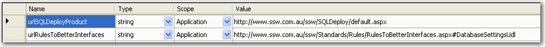

If you store your URL references in the application settings, you can create integration tests to validate them. 
 <excerpt class='endintro'></excerpt> 
<dl class="image"><dt>​​</dt><dd>Figure: URL for link stored in application settings</dd></dl>

   <b>​Sample Code: How to test the URL</b>

	[Test]  public void urlRulesToBetterInterfaces()  {  HttpStatusCode result = WebAccessTester.GetWebPageStatusCode(Settings.Default.urlRulesToBetterInterfaces);  Assert.IsTrue(result == HttpStatusCode.OK, result.ToString());  }

	
    
   <b>Sample Code: Method used to verify the Page</b> 

	 public class WebAccessTester  { 
     public static HttpStatusCode GetWebPageStatusCode(string url)  {  HttpWebRequest req = ((HttpWebRequest)(WebRequest.Create(url)));  req.Proxy = new WebProxy();  req.Proxy.Credentials = CredentialCache.DefaultCredentials;  HttpWebResponse resp = null;  try  {  resp = ((HttpWebResponse)(req.GetResponse()));  if (resp.StatusCode == HttpStatusCode.OK)  {  if (url.ToLower().IndexOf("redirect") == -1 && url.ToLower().IndexOf(resp.ResponseUri.AbsolutePath.ToLower()) == -1)  {  return HttpStatusCode.NotFound;  }  }  }  catch (System.Exception ex)  {JavaScript  while (!(ex == null))  {  Console.WriteLine(ex.ToString());  Console.WriteLine("INNER EXCEPTION");  ex = ex.InnerException;  }  }  finally  {  if (!(resp == null))  {  resp.Close();  }  }  return resp.StatusCode;  }  }

 ​ 

