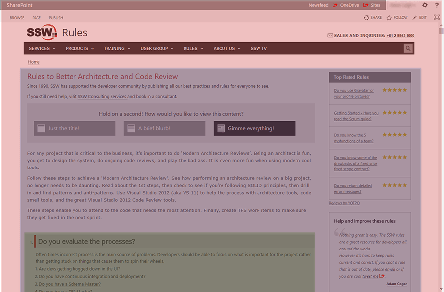
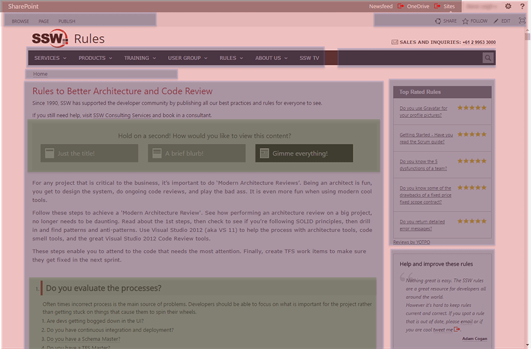

The Single Responsibility Principle is a well understood, and well-accepted tenant of good code design.  It states that a class should do one thing, and do it well – and an Angular component is no exception.

When designing components, keep them small, modular and reusable. For example, if you have a menu, put it into a menu component, don’t put it in your app component.

<!--endintro-->

::: bad  
  
:::

::: good  
  
:::
