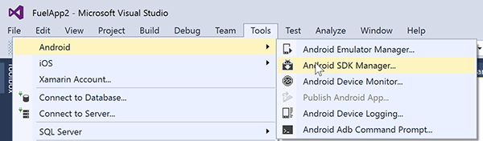
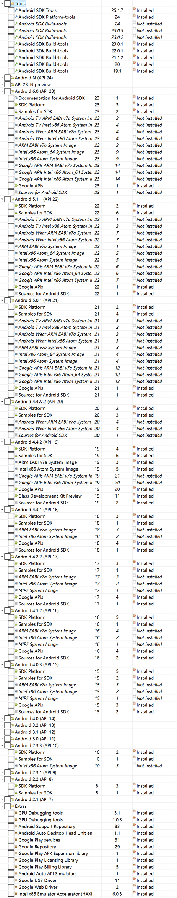

​Installing Visual Studio is not enough.... There is another 2 hours plus of downloading and installing to get to your first successful Xamarin hello world app. 
 <excerpt class='endintro'></excerpt> 
<h3>Step 1</h3>
Install VS 2015 + the Xamarin extension:  <a href="https://msdn.microsoft.com/en-us/library/mt613162.aspx" target="_blank">https://msdn.microsoft.com/en-us/library/mt613162.aspx</a>
<dl class="image"><dt>  </dt><dd>Figure: You need "C#/.NET (Xamarin v4.1.0)</dd></dl>
 
   <b>Note:</b> Xamarin Studio doesn't exist on the PC anymore. 
<h3>Step 2 - Android SDK Manager (about 2 hours)</h3>
This one is painful...  
<dl class="image"><dt>  </dt></dl>
Then get all the ones that say "Installed" : 
<dl class="image"><dt>  </dt></dl><h3>Step 3 - "Manage NuGet Packages for Solution" (about 30 minutes)   </h3>
Create a Blank App (xamarin.Forms Portable) project (this way it will trigger grabbing all extra stuff). Check and ensure Nuget Packages are up to date . 
<dl class="image"><dt>  </dt></dl><dl class="image"><dt>  </dt></dl><h3>Step 4 - run the app </h3>
Actually run the application you’ve created. Ensure it builds. It won't =D well first time it often won't, if it does then congratulations you have got everything!

