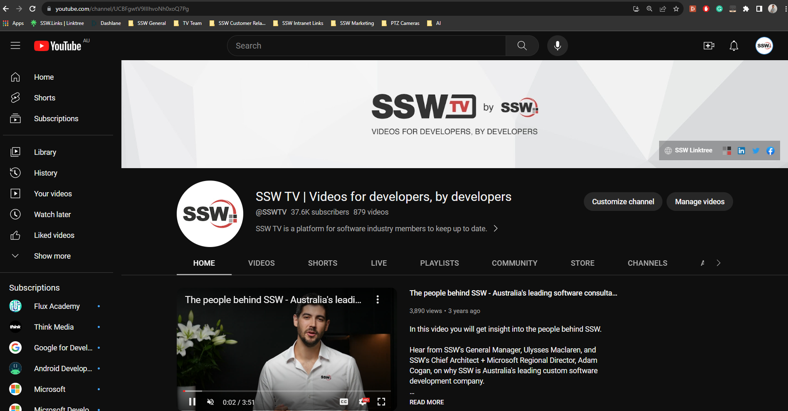
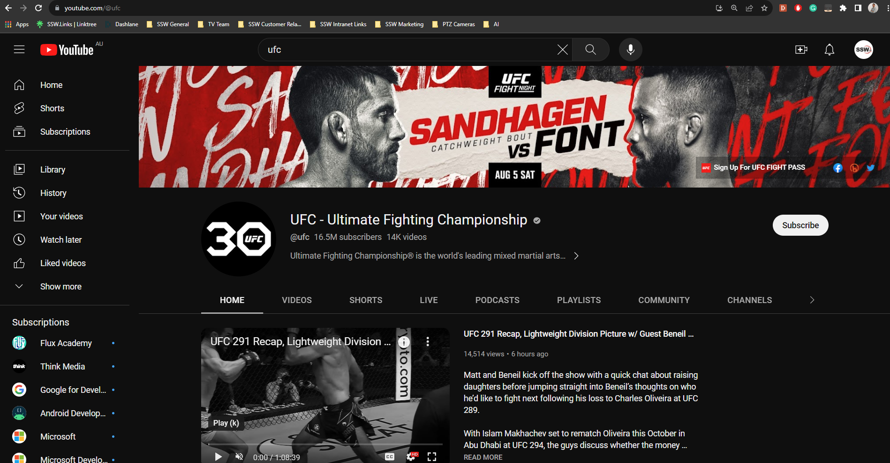

Imagine a potential client visiting your YouTube channel, keen to engage with your content but clueless about the next event you're hosting. You skip a valuable chance to connect with your audience if you don't highlight upcoming events on your banner. It's a great way to show off what you're promoting or hosting!

<!--endintro-->

### Why?
* **Engagement and connection**: A visual and current home page creates anticipation and informs your audience about your next event.
* **Professionalism**: A timely and well-designed banner shows commitment to quality and consistency.
* **Relevance**: It keeps your channel relevant and gives viewers a reason to check out your content.

### How?

1. As soon as you confirm an event, you should begin the design process. This could mean sending a task to your designers.
2. Make sure the banner gets approved by the relevant people.
3. Set yourself a reminder to update the banner on the day following the prior event.
Note: If your event is next in line, use the new banner as soon as it's ready.

::: bad

:::

::: good

:::
