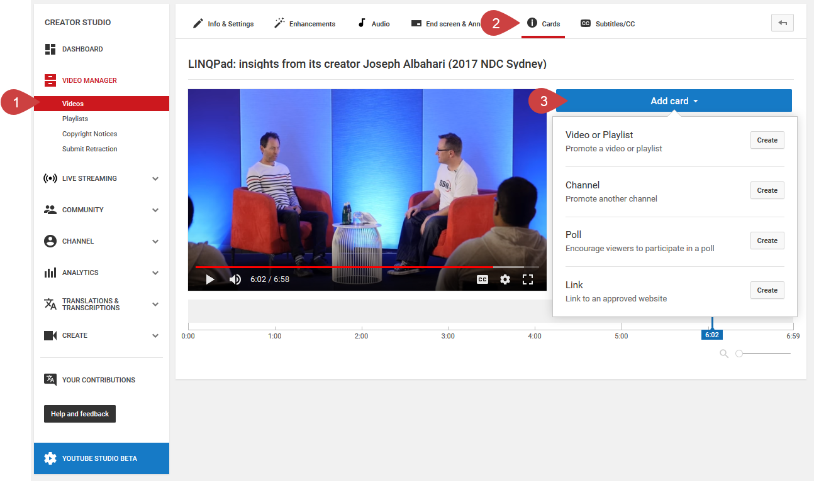

Cards on YouTube are an effective way to keep people watching your videos by suggesting to the viewer the other videos they could be interested in.

 <excerpt class='endintro'></excerpt> 

You could also promote an external website <a href=/do-you-add-end-screen-to-your-youtube-videos>(just like with ed screens)</a> but remember you want people to stay on YouTube and keep watching your videos.
<dl class="ssw15-rteElement-ImageArea">  </dl><dd class="ssw15-rteElement-FigureGood">Good example: A card is discreet and adds an easy way for the viewer to get to the relevant content. </dd>
 

Cards are like dynamic notifications in the top right corner of your video and you can choose the exact moment it should pop up. Cards can include images, outside links (try to avoid those) and even content that is downloaded when viewers click (an eBook for instance). You can add up to five cards per video and each card can:
<ul><li>Promote another video or playlist of your channel</li><li>Promote another channel on YouTube</li><li>Ask for a donation for a nonprofit cause of your choice</li><li>Ask a poll</li><li>Link to an approved website </li></ul><dl class="ssw15-rteElement-ImageArea"> </dl>
<strong>Figure:</strong> To add a card, go to VIDEO MANAGER | Videos | (select your video) | Cards | Add card 

The process is then intuitive, simply add your text, your link and when should the card pop up and you’re set! Indeed make sure the card is relevant to the moment it appears. For example, if in the video someone is referring to an external source or a previous videos, it could be wise to suggest this source or video when the person mentions it.

Cards work on desktop and mobile devices too!
<dl class="ssw15-rteElement-ImageArea"> </dl>
<strong>Figure:</strong> Although they look different, cards do work on mobile devices. This a screenshot of our video <a href="https://www.youtube.com/watch?v=0gSgpzmbrBM">Going Hardcore on your Business Intelligence with Power BI - Adam Cogan</a>. 

You can see a demo at 0:58 in our video <a href="https://www.youtube.com/watch?v=gEps81rL1-Y">Workplace Happiness: How to be happy at work with Kylie Hunt (2017 NDC Sydney)</a>.  

