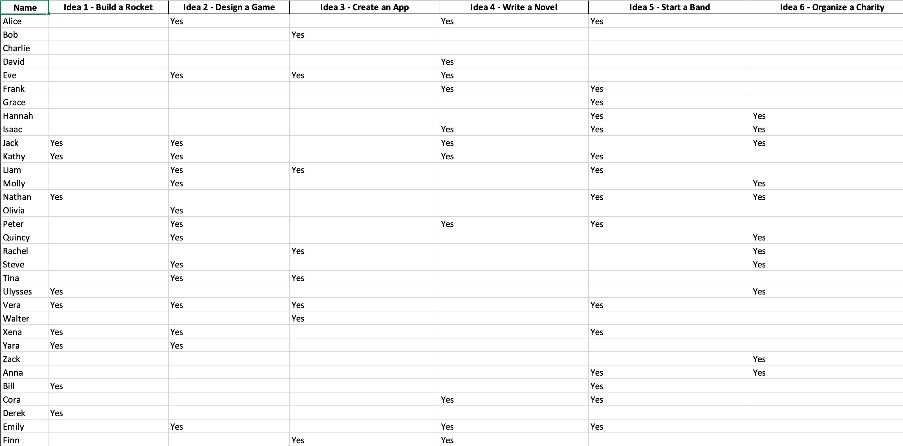
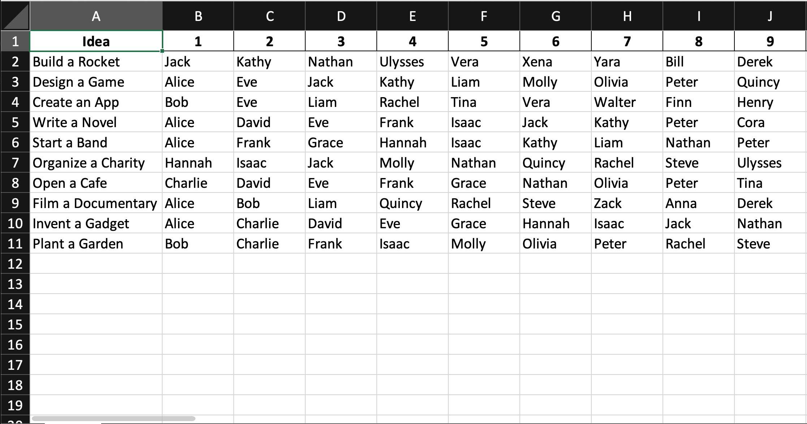

Separating the group into teams on the brainstorming day can take a long time. It is better to do this before the day. Doing it early also allows you to keep team sizes consistent and share the teams with the group before the day.

## Idea voting - Gather, iterate and gauge interest in ideas
Now that you have some initially curated ideas use Microsoft forms to gather, iterate and gauge interest in ideas. Here's what to do:

1. Create a Microsoft Form and populate the intro with a short explanation of the day, some previous success stories, and the list of GitHub Discussions
2. Add the following questions to the form

- ✅ Retro - What is working well at {{ COMPANY NAME }}?
- ❌ Retro - What are 1 (or more) things that you would improve at {{ COMPANY NAME }}?
- 💡 Any brainstorming ideas for next week? (that is not listed above)
  Copy your idea into the {{ EVENT NAME }} GitHub Discussion:
  {{ LINK TO GITHUB DISCUSSION }}

  ⚠️ GitHub Tip: Observe the lock for the repo indicates that these discussions are private 🔐

3. 1 week before the brainstorming session send out the form to the company.
4. 1 day before the brainstorming review the results of the form, curate the ideas, and create GitHub Discussions for any new and awesome ideas.
5. Using the nicely curated ideas, create a 2nd Microsoft Form with the following questions:

- Ideas - Rank the importance of fixing these items

  👨 = friendly for non-devs

8. Send that form out to all employees to gauge interest and importance in the ideas.

## Team allocation

Ensure everyone has completed the voting form before allocating teams.

Typically, the form responses exported to Excel will be in a format like this.

This data format makes it hard to assign teams, you can use ChatGPT Advanced Data Analysis to transform data into a better format.

Upload the Excel file to ChatGPT and use this prompt

::: greybox
I need this data in a format to allocate teams, I want each idea as a row then each person who voted for that idea as a column after it.
:::

1. To assign teams, start by assigning the most capable people to each team as a team lead - its not required but is helpful if this is the person who came up with the idea
2. After each team has a team lead, assign the remaining people based on their preference, skillset and interests

- Aim for team sizes 3-5 people
- Any larger than this is, it is too hard to manage and get everyone involved.
- Try to encourage inter-office communication by putting people from different offices in the same team.

1. Each team also needs to be assigned an Idea Product Owner person to test the presentation and give feedback.
2. Once everyone is allocated a team, share the result with the group.

## Team setup

In order to make the brainstorming day as productive as possible, set up the PowerPoints using a template.

1. Create new Teams team for the Brainstorming day E.g. Sydney Brainstorming 2023
2. For each team, create a folder in the Files tab
3. Use a brainstorming PowerPoint template to create a PowerPoint for each team
    - The template should have the structure of a good Brainstorming presentation (Show the pain, suggested solutions and proposed next steps)

`youtube: https://youtu.be/C6XdZgxy2K8`
**Figure: Brainstorming powerpoint template**

Having all the presentations in one location makes it easy to collaborate and ensures they wont be lost.