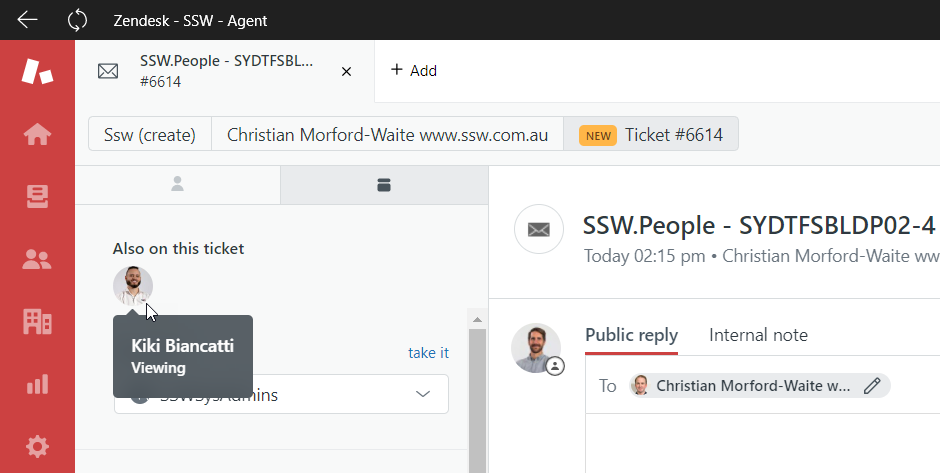

One of the advantages of Zendesk (and other ticketing systems) is that requests go to a number of people, but one person is assigned. This stops requests getting blocked as anyone can pick it up - but there is also ownership once it is assigned.

To avoid two people working on a ticket at the same time, you should assign a ticket to yourself **before** you start working on it.

<!--endintro-->

It can be tempting to quickly solve a ticket and then assign it to yourself after, when you're marking the ticket as solved - especially when you receive the requests as emails. However, this can mean that two people will start working on the ticket at the same time - doing the work, and taking screenshots ready for a good response. Even for a quick ticket, this will double the amount of work done. The process should be:

1. Receive the request
2. Assign it to yourself, and add a priority (if appropriate)
3. Submit as Open
4. Work on the ticket
5. Once solved, send a detailed reply and submit as Solved.

Remember you can always re-assign the ticket to someone else if required.

It's also worth noting that you can see if someone else is currently viewing a ticket. This can also help to avoid duplicating work - if you see that someone else is viewing a ticket, have a chat with them before you start working on it.

