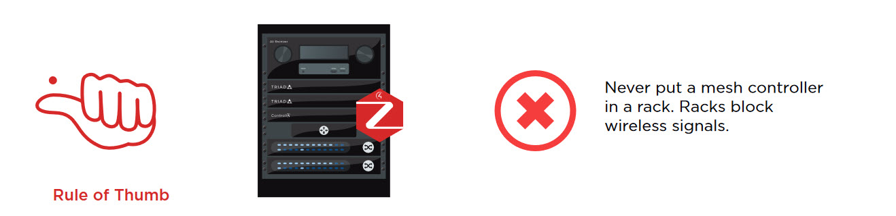
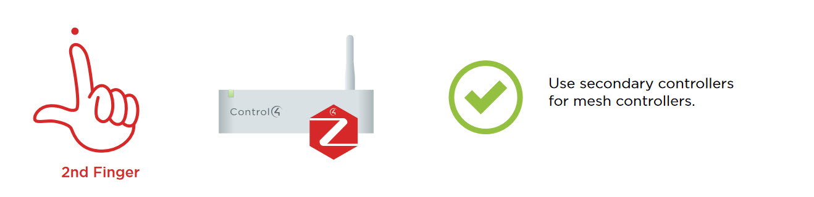
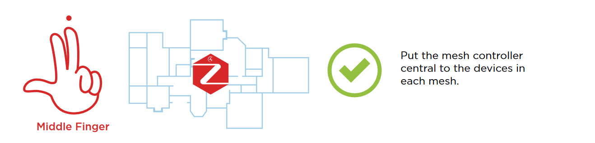
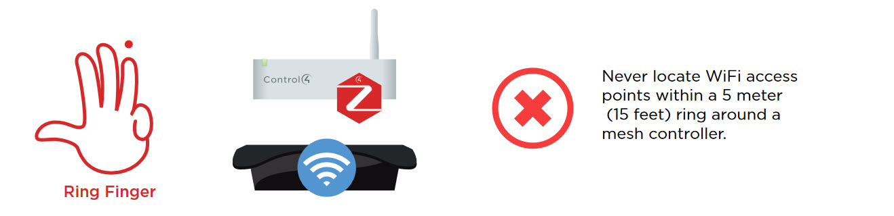
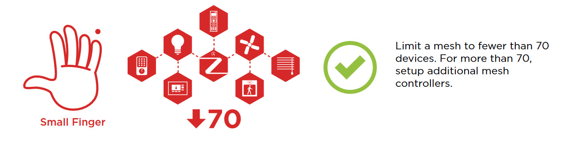

Zigbee is a wireless communication protocol designed for Internet of Things (IoT) devices. It operates on the 2.4GHz frequency band and is a popular choice for smart home automation. Zigbee uses a mesh networking topology to enable communication between devices, providing reliability and flexibility. It is the wireless protocol choice for Control4.

<!--endintro-->

To ensure optimal performance in a Control4 smart home environment, it is important to follow the Zigbee design principles. These principles include:

### Never put a mesh controller in a rack

Placing a mesh controller in a metal rack can cause signal interference, resulting in poor performance of the Zigbee network. Instead, locate the mesh controller outside the rack.

### Use secondary controllers for mesh controllers

Secondary controllers can be used to control devices connected to the mesh controller. This reduces the load on the mesh controller and improves the overall performance of the network.

### Put the mesh controller central to the devices in each mesh

To optimize performance, the mesh controller should be located centrally in each mesh. This ensures that the signal has to travel the shortest distance to reach all devices in the mesh.

### Never locate WiFi access points within a 5 meter (15 feet) ring around a mesh controller

WiFi access points operating on the same frequency as Zigbee can cause interference and degrade the performance of the Zigbee network. Therefore, it is recommended to keep the WiFi access points at least 5 meters (15 feet) away from the mesh controller.

### Limit a mesh to fewer than 70 devices

For more than 70, setup additional mesh controllers.

By following these Zigbee design principles, users can ensure that their Control4 smart home network is stable, reliable, and secure.

You can learn more about the above at http://ctrl4.co/zigbee-infographic