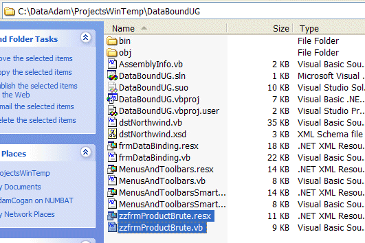

When you are regularly creating new releases of a cool .NET application or simply producing new proposals in Microsoft Word, files will inevitably become **outdated**. Rather than deleting them, put a 'zz' at the front of the filename. These old versions should not be deleted straight away - it is just an unnecessary risk! The zz'd files can remain there until you need more space, then you should delete them.

<!--endintro-->

::: info

**Warning:** You should not zz [if you are using source control](/do-you-know-zz-ed-files-must-not-exist-in-source-control).

:::

### Video versions and using 'zz' on YouTube

When uploading to some video hosting sites, like Vimeo, you can update a video by replacing the original video while keeping the same URL and view count.

In YouTube an uploaded video can't be replaced, so to create a new version of a video it will be uploaded as a new video with a new URL.

So that there are no broken or missing links, the video status is set to "unlisted", and we use the 'zz' process:

* Add 'zz' to the beginning of the title.
* Add a link to the latest version at the top of the description

::: good

:::

### Using 'zz' in practise

When you see ‘zz’ in the title of the video description, it’s important to know how to access the latest version of the video so you’re not watching old content.

On YouTube click the ‘New Version’ link in the description.

::: info

If you are deleting something that uses resources and/or cost money, it is a good idea to 'zz' it first - and use a follow up to remind yourself to delete it after a reasonable amount of time, as per: [https://www.ssw.com.au/rules/follow-up-effectively/](/follow-up-effectively/)

:::

### Not ready to 'zz'? Use 'yy'

Other systems are used that are less aggressive than this 'zz' rule.

* In .NET, the keyword ["obsolete"](https://msdn.microsoft.com/en-us/library/22kk2b44%28v=vs.90%29.aspx) is used to mark types and members of types that should no longer be used - these then turn up as a compiler warning
* In HTML content, the keyword [deprecated](http://www.ssw.com.au/ssw/Redirect/Deprecated.htm) is often used

Both allow for some backward compatibility. In these cases, use 'yy' instead.
