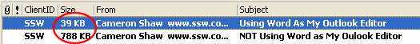

In Microsoft Outlook you have the option to use Word as your Email editor. 

<!--endintro-->

## 

This has a few advantages:

1. It automatically compresses images which you paste into your email (meaning a much smaller size email)
2. You get all the benefits of Word e.g. Formatting and styles, spell checking smart tags, thesaurus - the list goes on and on.
3. With the emergence of some great 3rd Party Smart Tags you can integrate your database in your email program. Companies often forget that improving their users' ability to handle email efficiently can be one of the biggest productivity gains you can achieve.

